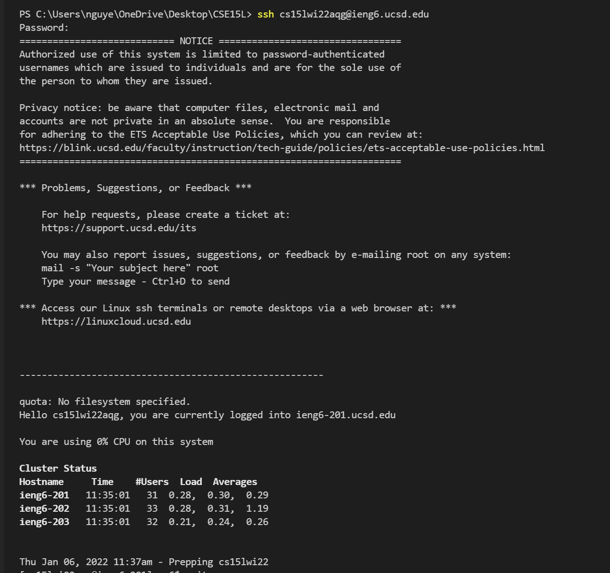

# Week 2 Lab Report

## Installing VSCode
Go to the [Visual Studio Code website](https://code.visualstudio.com/) and install it onto your computer. Use the drop down menu to choose which version you should download. The versions correspond to the operating system you are on.

After downloading and installing Visual Studio Code (VSCode), open VSCode and it should look similar to the screenshot below.

## Remotely Connecting
If you are on a Windows device, you must download a program called OpenSSH which allows you to connect your computer with other computers. 

Follow the steps on [this website](https://docs.microsoft.com/en-us/windows-server/administration/openssh/openssh_install_firstuse) to install OpenSSH.

Everyone will need their account which can be found with the following link:
[https://sdacs.ucsd.edu/~icc/index.php](https://sdacs.ucsd.edu/~icc/index.php)

On VSCode, open the terminal by clicking Terminal on the top of the screen then clicking New Terminal. 

In the terminal, you are going to input the following command where you replace "zz" with your own account which is what you previously looked up: `ssh cs15lwi22zz@ieng6.ucsd.edu`

The first time you connect, you will be asked if you are sure that you want to continue connecting. You can type yes and press enter. Next, you will be prompted to give your password. Enter in your password. It may seem like you aren't typing anything, but rest assured that you are!

Once you are logged in, you should get a message like the one in the below image. This means that you're connected to the server and the commands that you are running are running on the server.

## Trying Some Commands
Some commands that may be helpful that you can try in the terminal include `cd`, `cd ~`,  `ls`, `ls -lat`, `ls -a`, and `pwd`. Examples of what these commands do include how, `cd ~` takes you to the home directory and `ls - lat` lists out all the files in your current directory with additional information on those files.

Note: In order to logout of the remote server, you can type in the command `exit` to the terminal and press enter or press ctrl-D.

Examples of Commands in screenshot:

## Moving Files with `scp`

Copying files between the client(in this case, your computer) and the remote server is very important. To do so, you will be using the command `scp`.

In order to exemplify how this works, you are going to need to create a file called "WhereAmI.java" with code as shown in the screenshot:

You should be able to compile and run this file locally (on your computer, and not the server) with the `javac` and `java` commands. 

Now, you can  run the following command (replacing zz with your respective account code):
`scp WhereAmI.java cs15lwi22zz@ieng6.ucsd.edu`
You will need to reenter your password just like you did before when initially logging onto the server. Then, you will log onto the server with the same ssh command that you did before. 

As you can see, when you do `ls`, which lists the files in your current directory, WhereAmI.java shows up. This means that you have successfully copied the WhereAmI.java file onto the remote server!

## Setting Up an SSH Key

Now you need to set up an SSH key so that you won't be prompted to enter your password everytime you log onto the server. In short, you are going to use the `ssh-keygen` program which will create the public key file which you will copy to the server and private key file which you will copy to the client. The `ssh` will then use these files instead of your password. 

Enter the command `ssh-keygen` and this is what you should do to set up the SSH key...

For Windows, there is an extra step. Follow the steps in the screenshot below

To copy the the public key to the .ssh directory that's on the server, follow the steps below (of course, replace my account with your account, and replace my public key with yours) I had trouble with this originally because I kept using the private key so don't be like me!!
(You can get your public key from when you used the `ssh-keygen` command earlier)

After this is completed, when you `ssh` or `scp` to the server, you should not need to input your password anymore. YAY!

Notice below how my password is not asked for when logging back into the server!

## Optimizing Remote Running

To make remote running faster, you can include commands in quotes after the `ssh` command to run them in the remote server. You can also use semicolons in between commands to run multiple commands on the same line.

For example...

And that concludes the steps to logging onto a course specific account on ieng6 !!

Most Pleasant Process to Making a Local Edit to a File, Copying It to the Remote Server, And Running It

In order to copy paste the commands to make the one line command to copying a local edit to the remote server and running it, it took 14 keystrokes. The generated command first copies the contents of the file from the local server to the remote server, then it logs into the remote server to compile and run the file.
After having this command made, it should only take 2 keystrokes since you can just use the up arrow key to get the command again. 
