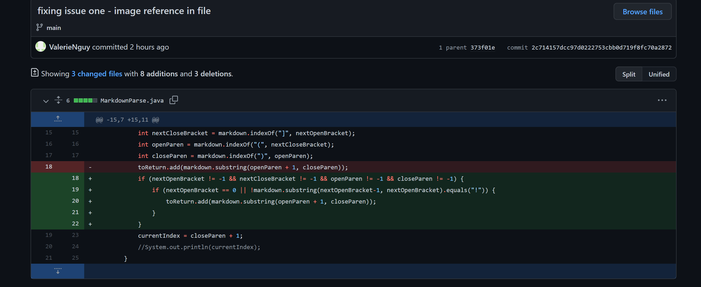
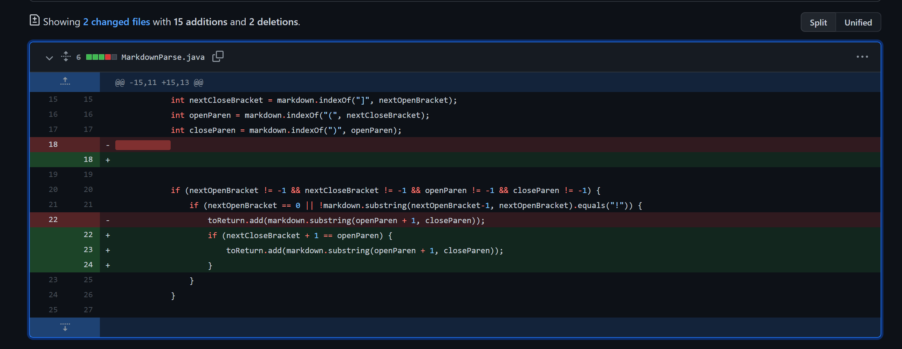
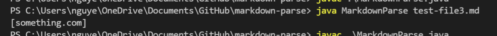

# Week 4 Lab Report

## Code Change 1

Link to Test File 1: [https://github.com/ValerieNguy/markdown-parse/blob/main/test-file.md](https://github.com/ValerieNguy/markdown-parse/blob/main/test-file.md)

The bug was that there was nothing in the code that dealt with having image references in the input file. Since an image reference (the failure-inducing input) has all the key characters that the program recognized as being part of a link (i.e. square brackets and parentheses), it registered them as links. The symptom to this was that the image references were part of the list of links that were printed which is not the expected output. 

## Code Change 2

Link to Test File 2: [https://github.com/ValerieNguy/markdown-parse/blob/main/test-file2.md](https://github.com/ValerieNguy/markdown-parse/blob/main/test-file2.md)

The program doesn't take into account any cases other than when there is a link for it to look at which is the bug. In this case, the input file didn't have any links (failure-inducing input) at all which caused the program to run infinitely. I didn't allow the program to continue running until an error was produced because my laptop was starting to lag out. Based on this, the symptom was that there was no output at all. 

## Code Change 3

Link to Test File 3: [https://github.com/ValerieNguy/markdown-parse/blob/main/test-file3.md](https://github.com/ValerieNguy/markdown-parse/blob/main/test-file3.md)

In this case, the [] and the () are far from each other (the failure-inducing input). The program still recognizes the link inside of the parentheses when it should as it is no longer in the link format which is the bug. Because of this, the output of the program when ran is that the link is still part of the output list when is shouldn't. This would be the symptom. 
