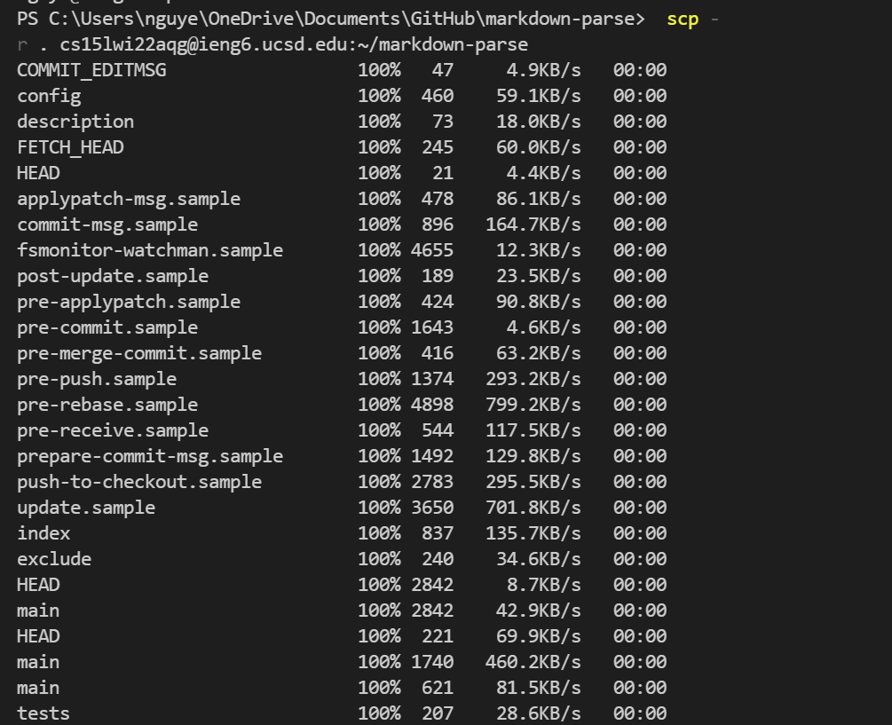
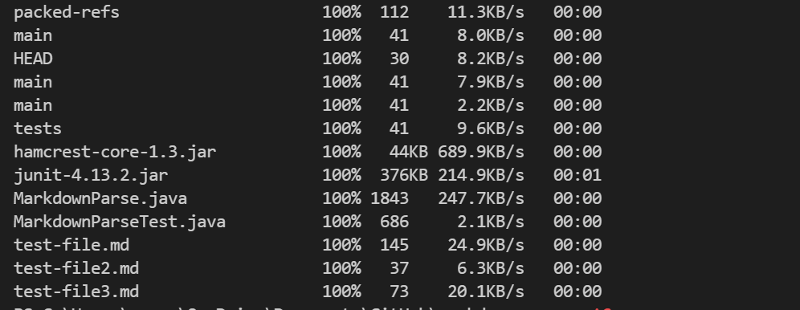
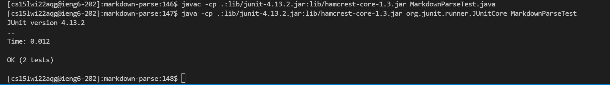
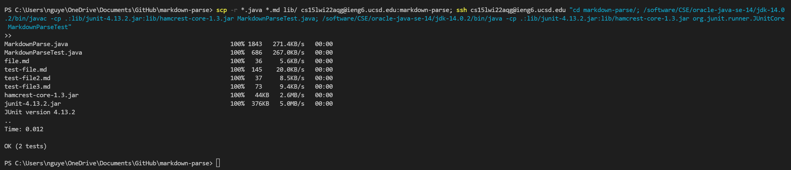

# Week 4 Lab Report

## Copy Whole Directories with `scp -r`

### Copying my whole markdown-parse directory to my ieng6 account

I used scp -r in order to copy the markdown-parse directory into my ieng6 account. What this does is it copies everything in the directory recursively. It goes through the directory you're trying to copy over and goes through the subdirectories so it copies all the files within the directory. You don't have to deal with manually copying each individual file to the remote server. If you had to copy each individual file, there would be a lot of room for mistakes which is why `scp -r` is useful.

### Logging into ieng6 account and compiling + running tests

Here, to show that everything in my markdown-parse directory was copied over, I compiled and ran the tests in my repository. Since it was able to run without any issues, this shows that everything was copied over successfully including the lib folder which contains the .jar files that we need to run the JUnit tests.

### Combining `scp`, `;`, and `ssh` to copy the whole directory and run tests in one line

I combined the `scp`,`ssh`, compiling, and running commands in order to copy the whole directory and run tests in one line. The command that I used, for reference, is the one below. It first uses `scp -r` in order to copy the whole directory to my ieng6 account. Then the command `ssh`'s into the server and compiles and runs the tests. 

`scp -r *.java *.md lib/ cs15lwi22aqg@ieng6.ucsd.edu:markdown-parse; ssh cs15lwi22aqg@ieng6.ucsd.edu "cd markdown-parse/; /software/CSE/oracle-java-se-14/jdk-14.0.2/bin/javac -cp .:lib/junit-4.13.2.jar:lib/hamcrest-core-1.3.jar MarkdownParseTest.java; /software/CSE/oracle-java-se-14/jdk-14.0.2/bin/java -cp .:lib/junit-4.13.2.jar:lib/hamcrest-core-1.3.jar org.junit.runner.JUnitCore MarkdownParseTest"`

And that's it! 