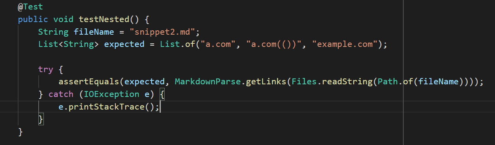
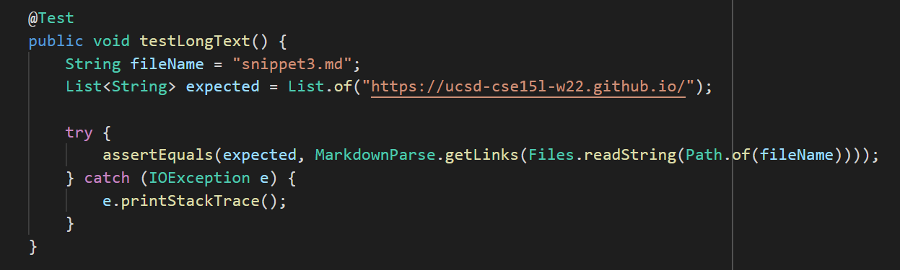

# Week 8 Lab Report

Link to My Markdown-Parse Repository:
[https://github.com/ValerieNguy/markdown-parse2](https://github.com/ValerieNguy/markdown-parse2)

Link to Markdown-Parse That I Reviewed:
[https://github.com/jordan-nishi/markdown-parse](https://github.com/jordan-nishi/markdown-parse)

Link to My Clone of the Markdown-Parse That I Reviewed:
[https://github.com/ValerieNguy/reviewed-markdown-parse](https://github.com/ValerieNguy/reviewed-markdown-parse)

## Snippet #1
Test for Snippet #1:
(used the same test for my repository and reviewed repository because the expected output is the same)

Expected Output From Snippet #1 According to CommonMark Demo Site:
``[`google.com, google.com, ucsd.edu]``

Output From Test For My Repository:

Output from Test for Reviewed Repository:

Both my repository and the reviewed repository didn't pass this test. They also both had the same output.

## Snippet #2
Test for Snippet #2:
(used the same test for my repository and reviewed repository because the expected output is the same)

Expected Output From Snippet #2 According to CommonMark Demo Site:
`[a.com, a.com(()), example.com]`

Output From Test For My Repository:

Output from Test for Reviewed Repository:

My repository and the reviewed repository had the same output from snippet #2 and both of them failed the test.

## Snippet #3
Test for Snippet #3:
(used the same test for my repository and reviewed repository because the expected output is the same)

Expected Output From Snippet #3 According to CommonMark Demo Site:
`[https://ucsd-cse15l-w22.github.io/]`

Output From Test For My Repository:

Output from Test for Reviewed Repository:

Output from both my repository and the reviewed repository was the same, but was not the expected output.

## Q&A
### Do you think there is a small (<10 lines) code change that will make your program work for snippet 1 and all related cases that use inline code with backticks?
I think there is a small code change that will make my program work for cases specifically in snippet 1 but I think in order to take care of all related cases requires more involved changes. After testing what the expected output is on different placements of backticks, I believe VSCode preview doesn't register a link when there is a backtick before the open bracket and the second backtick somewhere between the open bracket and closing parentheses. It wouldn't be too diffcult to find the index of the second backtick and compare it to the indexes of all the brackets and parentheses to determine whether or not the link should be included in the output. However, there are many other cases to consider before saying that the program works for all related cases with backticks. For example, if there is backtick right before the open bracket and the second backtick is one line after the line with the link information, the link isn't considered a link but if there is a couple empty lines before the second backtick, the backtick doesn't count that information as inline code and therefore it is a valid link. This is why I believe more involved changes are required.

### Do you think there is a small (<10 lines) code change that will make your program work for snippet 2 and all related cases that nest parentheses, brackets, and escaped brackets?
I think that a more involved change would be needed for my program to work for snippet 2 and all related cases. My reasoning behind this is that there are so many different variations of placement of nested parentheses, brackets, and escaped brackets that need to be accounted for. For just the cases present in snippet 2, in order for it to get the expected output, if you were to include a loop to find if there brackets within the brackets, you would also need to check if an extra pair of parentheses are present within the first pair of brackets and if there wasn't parentheses, you'd have to be able to revert back to the first bracket to continue the search. The many possible variations leads me to believe that more involved changes are required to account for these cases.

### Do you think there is a small (<10 lines) code change that will make your program work for snippet 3 and all related cases that have newlines in brackets and parentheses?
When it comes to newlines in brackets and parentheses, I think there is a small code change that will make my program work. In order to make my program work for this case, I think I would just need to check for newlines within brackets and parentheses. It seems that as long as there isn't an empty line between the brackets/parentheses, the links should be included in the output. All I would need to do is check is there are any newlines in the brackets and parentheses that have no text in order to deal with cases that have newlines in brackets and parentheses.