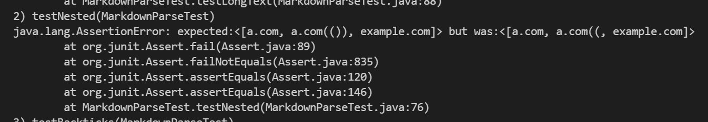

# Week 8 Lab Report

Link to My Markdown-Parse Repository:
[https://github.com/ValerieNguy/markdown-parse2](https://github.com/ValerieNguy/markdown-parse2)

Link to Markdown_Parse That I Reviewed:
[https://github.com/jordan-nishi/markdown-parse](https://github.com/jordan-nishi/markdown-parse)

## Snippet #1
Expected Output From Snippet #1 According to VSCode Preview
[`google.com, google.com, ucsd.edu]

Test for Snippet #1 In Reviewed Repository:

Output From Test For My Repository:

Output from Test for Reviewed Repository:

Both my repository and the reviewed repository didn't pass this test. They also both had the same output.

## Snippet #2
Expected Output From Snippet #2 According to VSCode Preview:
[a.com, a.com(()), example.com]

Output From Test For My Repository:

Output from Test for Reviewed Repository:

My repository and the reviewed repository had the same output from snippet #2 and both of them failed the test.

## Snippet #3
Expected Output From Snippet #3 According to VSCode Preview:
[https://ucsd-cse15l-w22.github.io/]

Output From Test For My Repository:

Output from Test for Reviewed Repository:
