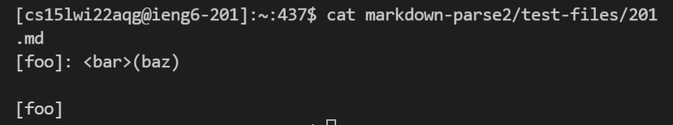
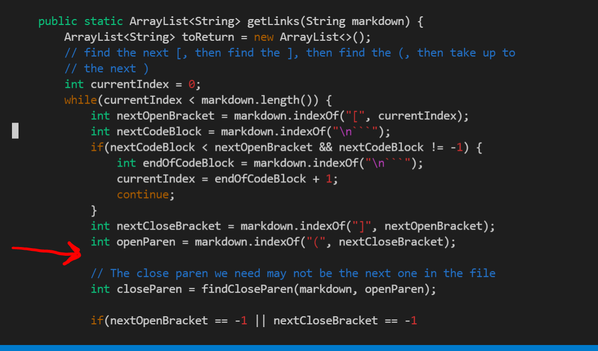
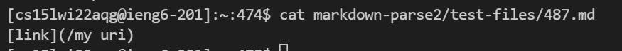
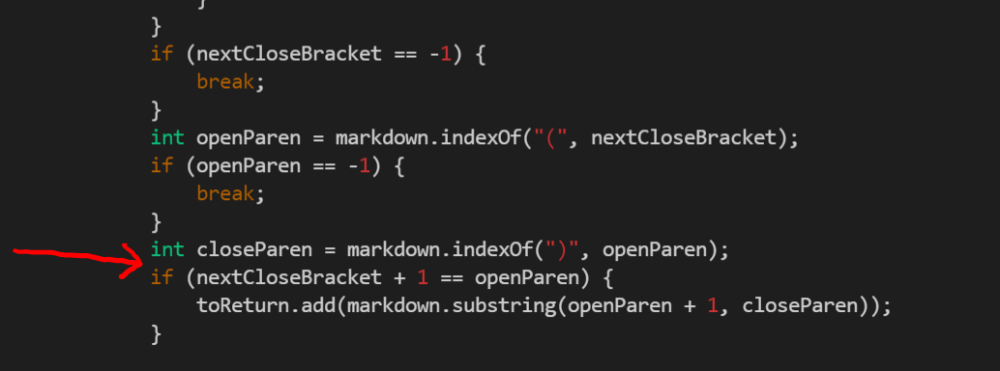

# Week 8 Lab Report

## How I Found the Tests With Different Results
I used the `diff` command on the results of running a bash for loop. My exact command was `diff markdown-parse2/results.txt markdown-parse/results.txt` where markdown-parse2 was the name of the folder with my personal MarkdownParse.java and markdown-parse was the name of folder with the provided MarkdownParse.java. This printed out the differences between the results.txt file in my repository and the results.txt file in the provided repository. This command also printed out the line where there was the difference so I could look at the results.txt files to find the name of the test file where the outputs didn't matched (since I added code to print out the name of the file in Lab 9 using `echo`). 

 ## Test 1
 This is for the test file "201.md" where the contents of the file are shown in the screenshot below.
 

 According to VSCode preview, the output of this test file should be `[]`.

 The output of markdown-parse2 is `[]` which is what the expected output is.
 
 On the other hand, the output of markdown-parse is `[baz]` which is not what is expected. 
 
 In order to fix this bug in markdown-parse, we would need to check if the index of the closed bracket is one before the index of the open parentheses since they need to be next to each other in order to be considered a link. A good place to add this would be after the index of nextCloseBracket is found and the index of openParen is found. We would use an if statement to check if the index of nextCloseBracket is one less than the index of openParen. If they aren't one after another, the supposed link shouldn't be added to the list of links in the output. This would be added around where the red arrow is in the screenshot below after we got the index of the open parentheses. 
 

## Test 2
This is for the test file "487.md" where the contents of the file are shown in the screenshow below.

According to VSCode preview, the output of this test file should be `[]`. 

The output of markdown-parse2 is `[/my uri]` which is not what is expected.

On the other hand, the output of markdown-parse is `[]` which is what the expected output is. 

In order to fix this bug in markdown-parse2, we would need to check if there are any spaces inside of the parentheses. The reason why this test file doesn't have any links is because there is a space within the supposed link. We would need to add an if statement to check if there is a space between the open parentheses and closed parentheses and if there is, then we don't consider it a link and if there isn't, then it could potentially be a link. One way of doing this would be to make another String variable that takes the substring of everything between the parentheses and then check if `indexOf(" ")` is equal to -1 which means that there isn't a space. A good place to implement this would be at the red arrow in the screenshot below where we just got the index of the closed parentheses. 
