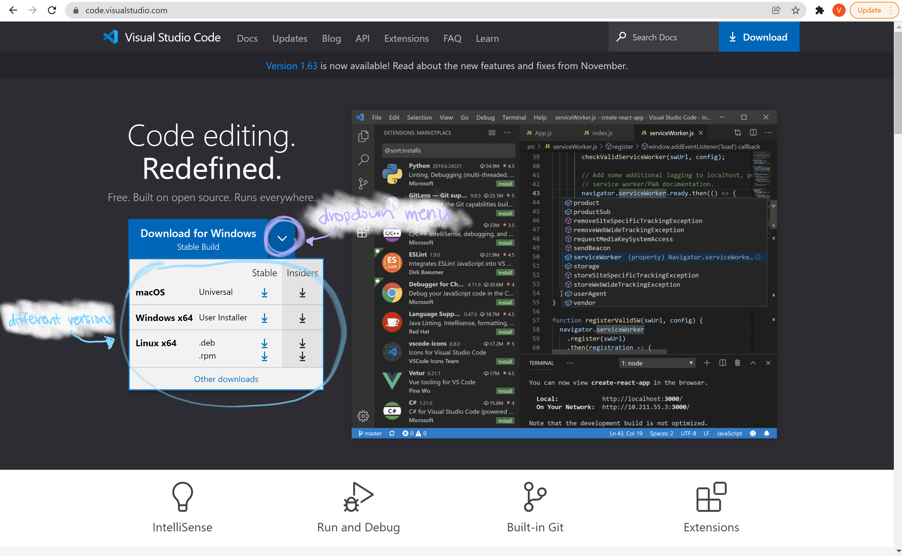
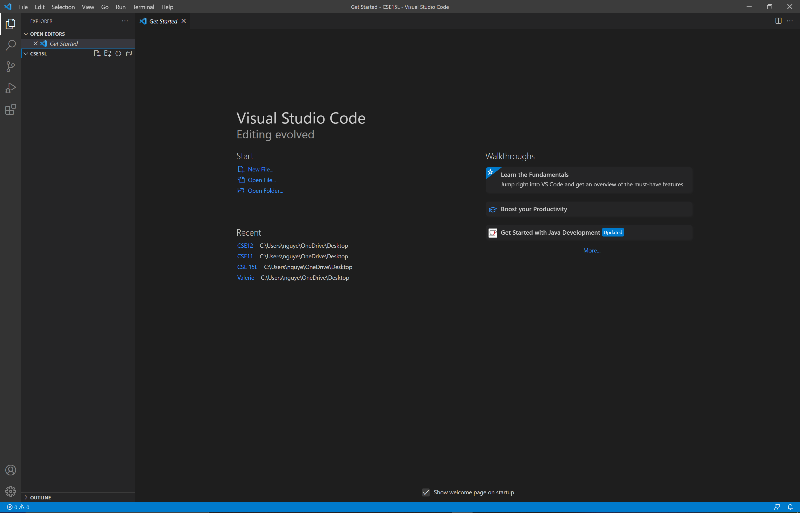
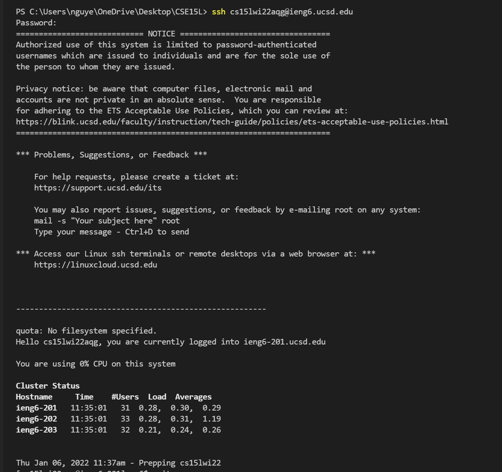

# Week 2 Lab Report

## Installing VSCode
Go to the [Visual Studio Code website](https://code.visualstudio.com/) and install it onto your computer. Use the drop down menu to choose which version you should download. The versions correspond to the operating system you are on.

After downloading and installing Visual Studio Code (VSCode), open VSCode and it should look similar to the screenshot below. It might differ slightly depending on your operating system.

## Remotely Connecting
If you are on a Windows device, you must download a program called OpenSSH which allows you to connect your computer with other computers. 

Follow the steps on [this website](https://docs.microsoft.com/en-us/windows-server/administration/openssh/openssh_install_firstuse) to install OpenSSH.

Everyone will need their account which can be found with the following link:
[https://sdacs.ucsd.edu/~icc/index.php](https://sdacs.ucsd.edu/~icc/index.php)
Your username is the username you use for TritonLink and the student ID is your ID that starts with A.

With this information, we are able to remotely connect to the server. 

On VSCode, open the terminal by clicking Terminal on the top of the screen then clicking New Terminal. 

In the terminal, you are going to input the following command where you replace "zz" with your own account what you previously looked up:
    ssh cs15lwi22zz@ieng6.ucsd.edu

## Trying Some Commands

## Moving Files with scp

## Setting an SSH Key

## Optimizing Remote Running

[Link For Index.md](index.md)