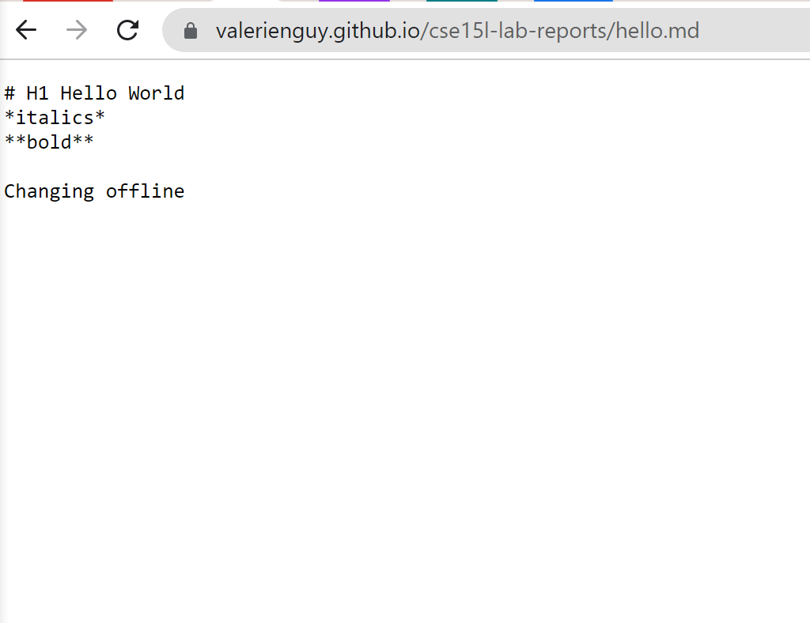

# Week 2 Lab Report

## Installing VSCode
Go to the [Visual Studio Code website](https://code.visualstudio.com/) and install it onto your computer. Use the drop down menu to choose which version you should download. The versions correspond to the operating system you are on.

After downloading and installing Visual Studio Code (VSCode), open VSCode and it should look similar to the screenshot below.

## Remotely Connecting
If you are on a Windows device, you must download a program called OpenSSH which allows you to connect your computer with other computers. 

Follow the steps on [this website](https://docs.microsoft.com/en-us/windows-server/administration/openssh/openssh_install_firstuse) to install OpenSSH.

Everyone will need their account which can be found with the following link:
[https://sdacs.ucsd.edu/~icc/index.php](https://sdacs.ucsd.edu/~icc/index.php)

With this information, we are able to remotely connect to the server. 

On VSCode, open the terminal by clicking Terminal on the top of the screen then clicking New Terminal. 

In the terminal, you are going to input the following command where you replace "zz" with your own account what you previously looked up:

**ssh cs15lwi22zz@ieng6.ucsd.edu**

The first time you connect, you will be asked asked if you are sure that you want to continue connecting. You can you type yes and press enter. 

You will be prompted to give you password. Type in your password and press enter. It may seem like you aren't typing anything, but rest assured that you are. 

Once you are logged in, you should get a message like the one in the below image. This means that you're connected to the server aka a computer in the CSE basement. This means that the commands that you are running are actually running on the server.

## Trying Some Commands
Some commands that may be helpful that you can try in the terminal include **cd**, **cd ~**,  **ls**, **ls -lat**, **ls -a**, and **pwd**. Examples of what these commands do include how, **cd ~** takes you to the home directory and **ls - lat** lists out all the files in your current directory with additional information on those files.

Note: In order to logout of the remote server, you can type in the command **exit** to the terminal and press enter or press ctrl-D.

## Moving Files with **scp**

You are going to need to be able to copy files between the client(in this case, your computer) and the remote server. To do so, you will be using the command **scp**.

In order to exemplify how this works, you are going to need to create a file called "WhereAmI.java" with code as shown in the screenshot:

You can compile and run this file locally (on your computer, and not the server) with the **javac** and **java** commands. 

Now, you can  run the following command (replacing zz with your respective account code):
**scp WhereAmI.java cs15lwi22zz@ieng6.ucsd.edu**
You will need to reenter your password just like you did before when initially logging onto the server. Then, you will log onto the server with the same ssh command that you did before. 

As you can see, when you do **ls**, which lists the files in your current directory, WhereAmI.java shows up. This means that you have successfully copied the WhereAmI.java file onto the remote server!

## Setting an SSH Key

Now you need to set up an SSH key so that you won't be prompted to enter your password everytime you log onto the server. In short, you are going to use the **ssh-keygen** program which will create the public key which you will copy to the server and private key which you will copy to the client. This will 

## Optimizing Remote Running

[Link For Index.md](index.md)